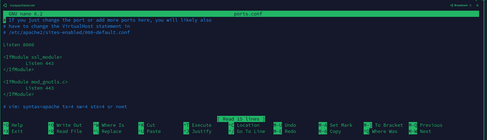

<h1>Implimenting Load balancers With  Nginx</h1>	

**Step 1**

**Provissioning EC2 instance called myapcheserver**

-  Created an ubuntu instance in Aws called myapacheserver

    

**Step 2**

**Inbound Rule**

- Added inbound rule to allow access to port 8000

   

-  With Termius, I connected successfully to myapacheserver

    

- With **sudo apt update**, I updated it

   

**Step 3**

**Installing Apache2 webserver** 

-  With **sudo apt install apache2 -y**. I installed apache2 webserver

   

- With this command,   <mark>systemctl status apache2</mark>, I checked to see if apache2 is installed and running.

   

**Step 4**

**Configuring Apache to serve a page showing its public Ip address**

-  I configured apache to serve a content on port 8000 by using nano command to edit **ports.conf** file in **etc/apache2/ports.conf** using super user privilage.

    

-  With super user privilages, I used nano command to edit **000-default.conf** file and changed port 80 to **port 8000**. The file is located in **etc/apache2/site-available/000-default.conf**.

     

-  Restarted apache with **systemctl reload apache2** for changes to take effect.

<h1>Creating my new html file</h1>

- In **var/www/html** folder, I created index.html and edited it using nano command to paste the code to show the public ip address

  

- With sudo chown **www-data:www-data ./index.html**, i changed index.html ownership

  

-  I restarted apache2 with **sudo systemctl restart apache2**

- In my web browser, I typed in http://54.90.200.130:8000/ and the following page came up:

   

- **Step 5**

**Configuring Nginx as Load Balancer**

-  I provissioned another ubuntu Ec2 instance called Loadbalancer.

-  

- With **sudo apt update** command, I updated the instance.

   

- With **sudo apt install nginx -y** command, I installed nginx and checked the status using **systemctl status nginx** command

  

  -  With cd command, i entered into **conf.d** directory and use **ls** command to show the contents and to locate the **loadbalancer.conf file** The file does not exist. So, i created it using touch command and change the ownwership. 

  

-  With nano command, I pasted the required code in loadbalancer.conf and edited it with the required parameters as shown bellow. 

    

    

    

  

-  To prevent nginx loadbalancer from loading its default config on port 80 which will load nginx default page, I changed the port to an unknown port which is not added in the inboud rule.  This activated my new configuration file which will listen on port 80 

-  using this command, **Curl localhost**, loaded my apache server content as shown bellow: 

  

  -  Using the public ip address of myloadbalancer in my browser, it opened my apache server content.

**Project completed** 

  

    

